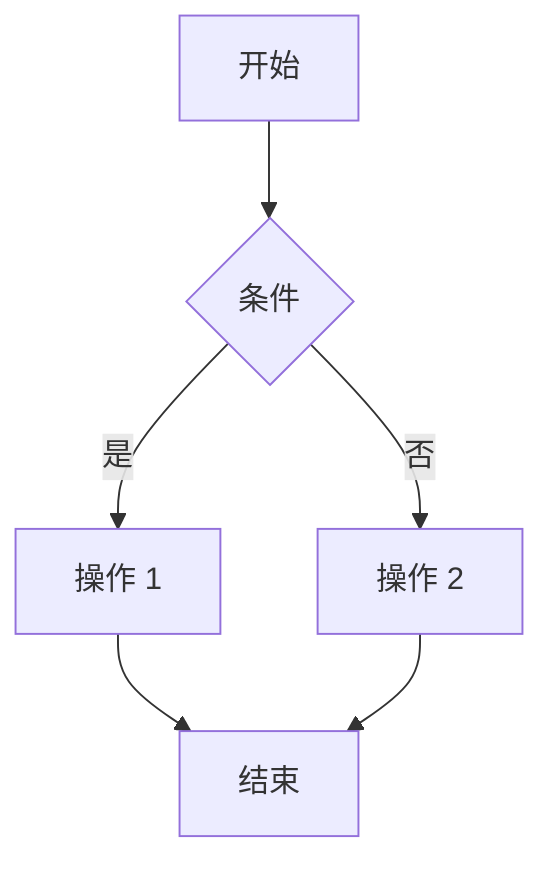
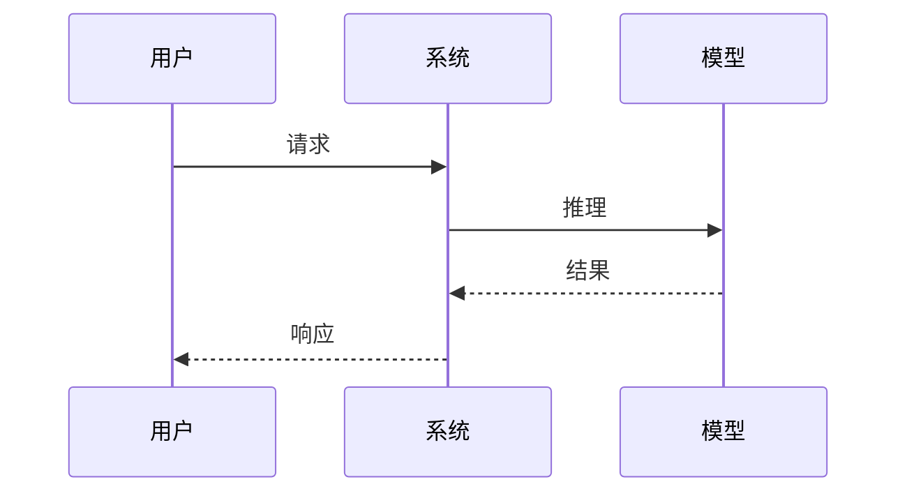

# Prompt: Mermaid 流程图

## 任务

为给定题目生成 Mermaid 流程图——适用于流程、决策树、状态机、时序。

## 适用场景

- ✅ 数据预处理流程（读取 → 清洗 → 转换 → 保存）
- ✅ 模型训练流程（划分 → 训练 → 评估 → 部署）
- ✅ 决策树（如何根据情况选择算法）
- ✅ 时序流程（请求 → 处理 → 响应）
- ❌ 静态对比 → 用 [diagram-svg.md](./diagram-svg.md)

## Mermaid 语法快速参考

### 流程图



### 序列图



VitePress 默认支持 Mermaid 渲染（需配置插件）。

## 风格要求

- **节点文字简短**（≤ 10 字）
- **流向清晰**（不要箭头交叉）
- **颜色克制**（默认黑白，关键节点最多用一种强调色）
- **中文优先**

## 输出格式

输出格式如下（包含 `mermaid` 代码块标记）：

````

````

## 输入

题目的 frontmatter。

## 现在开始

请为下面这道题生成 Mermaid 图：

```yaml
{ TASK_INPUT }
```

如果题目不适合 mermaid 图，输出 `（本题不适合 Mermaid 流程图）`。
